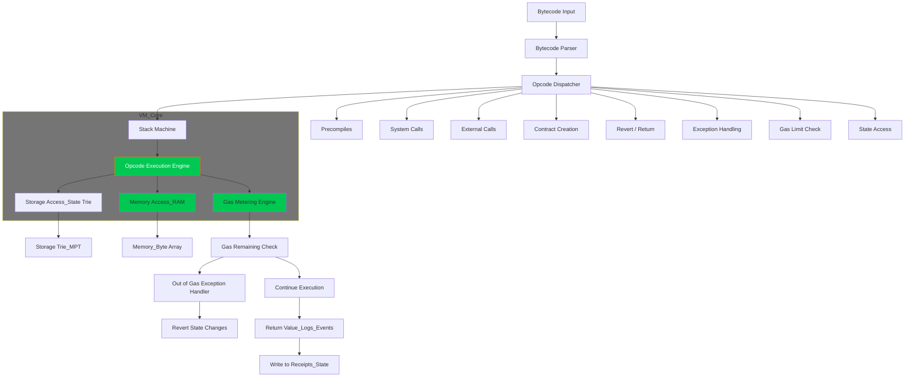

# Solidity Virtual Machine in Go

A lightweight Ethereum-compatible virtual machine implementation for compiling and executing Solidity smart contracts in Go.


## Overview

This project implements a simplified virtual machine capable of running Solidity smart contracts. It provides developers with insights into the inner workings of the Ethereum Virtual Machine (EVM) while offering a platform for testing and educational purposes.

## Features

- **Solidity Parsing**: Parse Solidity source code into abstract syntax tree (AST)
- **Bytecode Compilation**: Generate bytecode from Solidity contracts
- **VM Execution**: Execute bytecode with support for core EVM opcodes
- **State Management**: Track storage, memory, and execution context
- **Gas Accounting**: Simplified gas usage calculation

## Architecture

The project follows a modular architecture that mirrors the core components of the Ethereum protocol:

1. **Parser**: Converts Solidity source code into an Abstract Syntax Tree (AST)
2. **Compiler**: Transforms the AST into EVM-compatible bytecode
3. **Virtual Machine**: Executes the bytecode with stack, memory, and storage

## Project Structure

```
solidity-vm-go
├── cmd
│   └── main.go                # Application entry point
├── internal
│   ├── compiler               # Bytecode compilation
│   │   └── compiler.go        # Solidity to bytecode compiler
│   ├── vm                     # Virtual machine implementation
│   │   ├── executor.go        # Bytecode execution engine
│   │   ├── memory.go          # Memory management
│   │   ├── stack.go           # Stack operations
│   │   ├── storage.go         # Persistent storage
│   │   └── opcodes.go         # EVM opcode definitions
│   └── parser                 # Solidity parsing
│       └── parser.go          # Source code parser
├── pkg
│   ├── solidity               # Solidity-related utilities
│   │   └── types.go           # Solidity type definitions
│   └── utils                  # Shared utility functions
│       └── helpers.go         # Helper functions
├── examples                   # Example Solidity contracts
│   ├── simple_contract.sol    # Basic contract example
│   └── test_contract.sol      # Contract with more features
├── tests                      # Test suite
│   ├── compiler_test.go       # Compiler unit tests
│   ├── parser_test.go         # Parser unit tests
│   └── vm_test.go             # VM execution tests
├── go.mod                     # Go module definition
├── go.sum                     # Module dependency checksums
└── README.md                  # Project documentation
```

## Installation

### Prerequisites

- Go 1.18 or higher
- Solidity compiler (optional for real compilation)

### Building from Source

1. **Clone the repository**

```bash
git clone https://github.com/yourusername/solidity-vm-go.git
cd solidity-vm-go
```

2. **Install dependencies**

```bash
go mod tidy
```

3. **Build the project**

```bash
go build -o solvm ./cmd
```

## Usage

### Running the VM with Example Contracts

```bash
# Run with the included example contract
./solvm -contract examples/simple_contract.sol
```

### Using as a Library

```go
package main

import (
    "fmt"
    "os"
    "solidity-vm-go/internal/compiler"
    "solidity-vm-go/internal/vm"
)

func main() {
    // Read Solidity source
    source, err := os.ReadFile("path/to/contract.sol")
    if err != nil {
        panic(err)
    }

    // Compile the contract
    result := compiler.Compile(string(source))
    if result.Error != nil {
        panic(result.Error)
    }

    // Execute the contract
    executionResult := vm.Execute(result.Contract, nil)
    
    // Check execution success
    if !executionResult.Success {
        fmt.Printf("Execution failed: %v\n", executionResult.Error)
        return
    }
    
    fmt.Printf("Contract executed successfully\n")
    fmt.Printf("Gas used: %d\n", executionResult.GasUsed)
}
```

## Supported Opcodes

The VM supports a subset of EVM opcodes including:

| Category | Opcodes |
|----------|---------|
| Stack Operations | PUSH1-PUSH32, POP, DUP1-DUP16, SWAP1-SWAP16 |
| Arithmetic | ADD, SUB, MUL, DIV, MOD |
| Comparison | LT, GT, EQ, ISZERO |
| Bitwise | AND, OR, XOR, NOT |
| Memory | MLOAD, MSTORE, MSTORE8 |
| Storage | SLOAD, SSTORE |
| Program Flow | JUMP, JUMPI, PC, JUMPDEST |
| System | STOP, RETURN |

## Limitations

This is a proof-of-concept implementation with several limitations:

- Limited opcode support compared to the full EVM
- Simplified gas calculation
- No support for external contract calls
- Limited cryptographic operations
- No support for events and logs
- Mock compiler instead of full Solidity compilation

## Future Improvements

- Integration with full Solidity compiler
- Support for more complex opcodes
- Implementation of contract-to-contract calls
- More sophisticated gas calculation
- Enhanced debugging capabilities
- Support for EVM precompiled contracts

## Contributing

Contributions are welcome! Please follow these steps:

1. Fork the repository
2. Create a feature branch (`git checkout -b feature/amazing-feature`)
3. Commit your changes (`git commit -m 'Add some amazing feature'`)
4. Push to the branch (`git push origin feature/amazing-feature`)
5. Open a Pull Request

Before submitting a PR:
- Ensure code follows Go best practices
- Add tests for new functionality
- Make sure all tests pass
- Update documentation as needed

## Testing

Run the test suite with:

```bash
go test ./...
```

## License

This project is licensed under the MIT License - see the LICENSE file for details.

## Acknowledgments

- Ethereum Yellow Paper for EVM specification
- Go Ethereum (geth) for reference implementation
- The Solidity team for language inspiration

---

**Note**: This project is for educational purposes and not intended for production use. The Solidity VM implementation is a simplified version of the Ethereum Virtual Machine and does not include all security features required for a production environment.

Similar code found with 1 license type